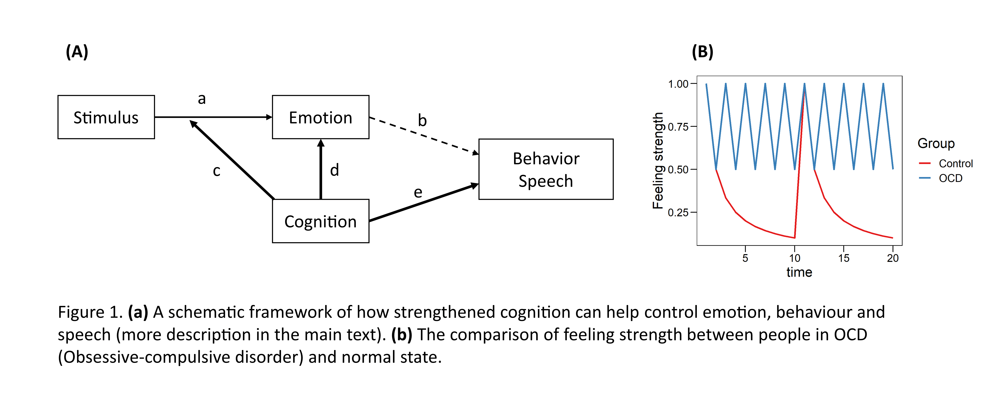

# Introduction
Each researcher facing the pandemic would more or less shows the symptom of mentally sub-health. I feel so exceptionally strongly. As an introverted unsociable person who is even not good at English, I live in a studio and have nobody to talk with. Gradually I found myself unable to controlling my thoughts and showing significant OCD case. For more than two weeks, I do nothing but forcing myself to think of something and simultaneously forcing myself not to do so.  More depressing is that I know this is wrong but I do not know what to do. After a long time of struggling,  I get through this situation with many helps from my friends and supervisors. During this "wasted" time, a good side is somehow I can recognize my emotions and started to learn how to observe and control it. Therefore I decided to write what I have searched and concluded. Hope I can express myself clearly then anyone reading this post can learn something when he/she need help to escape from the mental trap.

# Feelings in our brain
I divided my thoughts into two parts: `emotion` and `cognition`. I don't know if this division is scientifically correct, but I can confirm that these two are widely accepted concepts in Psychology after simply searching some keywords in Google Scholar (e.g. Okon-Singer et al., 2015). They interact with each other and collectively determine our motivation.

Cowen and Keltner (2017) have uncovered 27 varieties of emotions including admiration, anger, fear, joy, sexual desire etc,. Emotion is nature but also subjective. It is a neurophysiological response to some stimulus. For example, it is common for everyone to trigger sexual desire when we meet a lovely body. Therefore it is natural because all human have this "built-in" function. However, this is also subjective because people can have different kinds and extent of emotion when they face a similar thing. The past experience and cognition should decide how the certain emotion would appear.

Cognition is learned and acquired. Thus it is not as natural and fast-responding and fading as emotion.  It is belived that the neocortex which plays an influential role in sleep, memory and learning processes is evolved later than the limbic system deciding the emotion and motivation (Wikipedia). In human behavior, it might be why we usually face the case that we cannot control our emotion even though we should not care it. 

# Relax, strengthen cognition through meditation

Because cognition is acquired, there are some ways to exercise it, e.g., meditation. Lutz et al., (2008) reviewed the possible mechanisms and functions of two varibles of meditation, focused attention (FA) meditation and open monitoring (OM) meditation. The former entails the voluntary focusing of attention on a chosen object, while the other involves nonreactive monitoring of the content of experience from moment to moment.

For me, the later one is applicable and useful. Unfortunately I cannot give much details of how to practice this and this is not the purpose of this post. I would rather show how enhanced cognition can change our emotion and life.

As the Fig. 1a shows, five process link the stimulus, emotion/cognition and our final behavior/speech. Arrow *a* represents the native stress response, typical example is our desires. Arrow *b* represents the emotion-motivated behavior and speech like ingesting, sexual behavior, impolite speech to your loved ones and lots of other impulsive behaviors (which often causes our regret). Arrow *c* is the first function of cognition: regulating how emotions generated in certain contexts. Similarly, arrow *d* means treating our emotion purposely. A good example is the OM meditation which monitors emotion and let it pass naturally. Process c and d can be done simultaneously, in the thinking process like saying "you didn't intend to do this, don't be upset (d), you can do it better next time (c)". The last process *e* is simple "two dots one line" pattern which occurs hundreds of times per day in our mind. You HOPE TO do something and carefully manage it.

The right sub-figure represents how OCD-patient and healthy person differentiate in emotion. Assume emotion decay exponentially, most emotion would disappear very soon. However, OCD-patients often remind themselves that something haven't been done and this causes long-term active in some brain regions. One may find or have found this through brain-scanning machine and I do believe this should be true.

With stronger cognition, process *b* would be weakening because cognition become the dominating factor deciding our behavior and speech. We can also prevent and treat our unwanted emotion in a rational way. It is not saying the emotion lost its impacts anymore (which is impossible for any animal) but we can control our emotion and reduce the influence of unwanted negative emotion.

# Final note
I am not a professional researcher in Psychology and Neurosciece. Many opinions in this post have not been tested or I have not checked them. Please carefully treat them.

